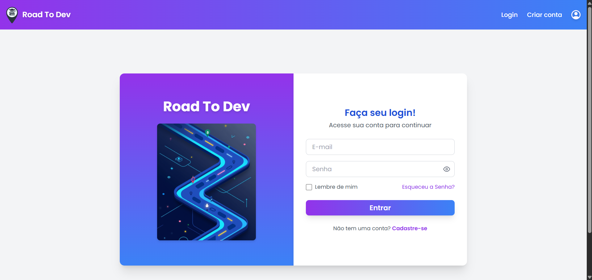
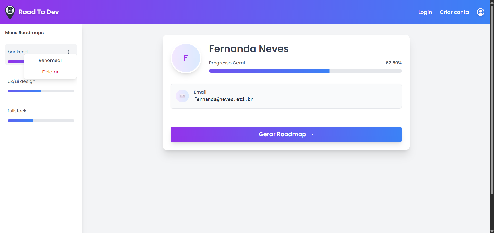
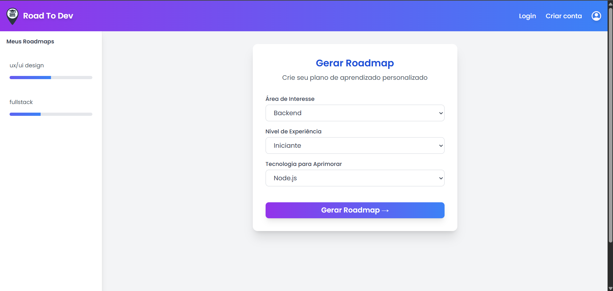
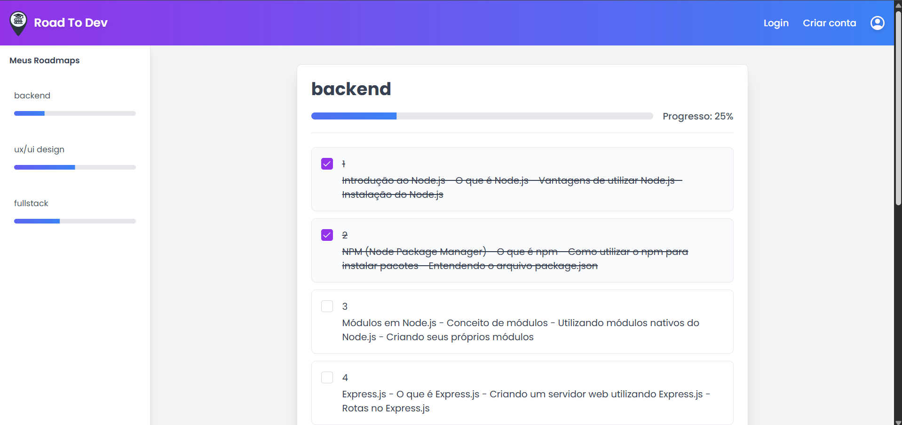

# **RoadToDev - Roadmap Generator**

RoadToDev is a web-based application developed as part of our "Software Development" course, where we were tasked with creating a real-life application using artificial intelligence. The platform helps developers generate personalized learning roadmaps based on their skills and interests. By analyzing user input from the form, the OpenAI API generates a roadmap outlining the areas the user should focus on, providing an interactive and dynamic experience. This project showcases a full-stack implementation using modern technologies and best practices.

---

# **Team RoadToDev**

| **Name** | **GitHub** | **LinkedIn** | **Email** |
|----------|------------|--------------|-----------|
| **Fernanda Neves (fmn)** | [fiefaneves](https://github.com/fiefaneves) | [LinkedIn](https://linkedin.com/in/fernandam-neves) | [fernanda.marnev@gmail.com](mailto:fernanda.marnev@gmail.com) |
| **Giovanna Mafra (gmm8)** | [GiovannaMafra](https://github.com/GiovannaMafra) | [LinkedIn](http://www.linkedin.com/in/giovanna-marques-mafra) | [gmm8@cin.ufpe.br](mailto:gio.marques.m@gmail.com) |
| **Heitor Barros (hfmb)** | [H3ITHOR](https://github.com/H3ITHOR) | [LinkedIn](https://www.linkedin.com/in/heitor-barros-679845205/) | [eito@gmail.com](mailto:heitorfelipe37@gmail.com)|
| **Josias Netto (jhcn)** | [JosiasNetto](https://github.com/JosiasNetto) | [LinkedIn](https://www.linkedin.com/in/josiasnetto/) | [jhcndev@gmail.com](mailto:jhcndev@gmail.com) |
| **Julia Zovka (jzs)** | [julia-zovka](https://github.com/julia-zovka) | [LinkedIn]([https://www.linkedin.com/in/j%C3%BAlia-zovka-de-souza-a4731235a/) | [jzs@cin.ufpe.br](mailto:zovkasj@gmail.com) |

--- 

## **Table of Contents**

1. [Features](#features)  
2. [Live Demo](#live-demo)  
3. [Technologies Used](#technologies-used)  
4. [Getting Started](#getting-started)  
   - [Prerequisites](#prerequisites)  
   - [Installation](#installation)  
5. [Test locally](#test-locally)  
6. [Project Structure](#project-structure)  
7. [Contributing](#contributing)  
8. [License](#license)  

---

## **Features**

- User authentication with JWT, including login, registration, and password reset.
- AI-powered roadmap generation tailored to user preferences.  
- Interactive form to evaluate developer skills.  
- Progress tracking with visual indicators and percentage completion.
- Ability to mark topics as completed.
- Recommendations Based on Market Trends
- Interactive learning with recommended resources for each topic.
- Responsive and modern UI/UX.

---

## **Live Demo:** [RoadToDev](https://road-to-dev.vercel.app)

### Login Page


### User Page


### Forms Page


### RoadMap Page


---

## **Technologies Used**

### **Front-End**
- Next.js (React Framework)
- TypeScript
- TailwindCSS
- Shadcn/UI
  
### **Back-End**
- Node.js
- Express
- dotenv
- cors
- mongoDB
- mongoose
- bcrypt
- jsonwebtoken
- nodemailer

### **AI/External APIs**
- OpenAI API - chatgpt-3.5-turbo (for recommendations and roadmap generation)

---

## **Getting Started**

### **Prerequisites**

Ensure you have the following installed:
- Node.js 
- npm  

### **Installation**

1. Clone the repository:
    ```bash
    git clone https://github.com/fiefaneves/RoadToDev.git
    cd RoadToDev
    git checkout locally-test
    
2. Install dependencies for the front-end:
    ```bash
    cd front-end/my-app
    npm install next react react-dom
    npm install --save-dev typescript @types/react @types/node
    ```
3. Install dependencies for the back-end:
    ```bash
   cd ../../back-end
   npm install cors openai dotenv express mongodb mongoose bcrypt jsonwebtoken
   ```
4. Set up environment variables:
    - Create .env file in the back-end directory.
    - Instruction to the Professor: Copy and paste the content of the "ENV-PROJECT" file anexed in the classroom or in the drive of the team.
    - Example variables for the back-end:
    
    ```bash
    OPENAI_API_KEY=your_openai_api_key
    MONGO_DB_KEY=your_mongo_db_key
    JWT_SECRET=meu_segredo_super_secreto
    EMAIL_USER='APPLICATION_EMAIL'
    EMAIL_PASS='EMAIL_PASSWORD'
    ```

### **Test locally**

1. Start the back-end server:
    ```bash
    cd back-end
    npm run dev
    ```

2. Start the front-end development server:
- open a new terminal

    ```bash
    cd front-end/my-app
    npm run dev
3. Open the app in your browser:
    http://localhost:3000

## **Project Structure**
### **Front-End**

    frontend/
    │── .next/                              #next modules
    │── node_modules/                       #nodejs modules
    │── public/                 
    └── src/                    
        │── app/
        │  │── api/
        │  │  └── generate.js
        │  │── create_account/
        │  │   └── page.tsx                
        │  │── esqueci-senha/
        │  │   └── page.tsx               
        │  │── forms/
        │  │   └── page.tsx               
        │  │── intermediateScreen/
        │  │    └── page.tsx                #user screen
        │  │── mudar-senha/
        │  │   └──page.tsx                  #login screen
        │  │── roadMap/
        │  │   └──page.tsx                  #generated roadmap screen
        │  │── test/
        │  │   └── button.test.tsx
        │  │   └── links.test.tsx
        │  │   └── sidebar.test.tsx
        │  │── layout.tsx                   #layout configuration
        │  │── page.tsx                     #home page info
        │  └── RoadMapContext.tsx 
        │── Components/
        │   │── ui/                         #components from shadcn ui
        │   └── sidebar.tsx
        │── hooks/                          #reusable functions
        │── lib/
        │   └── utils.ts
        └── styles/
            └─ globals.css                 #global css
        
        
                   
### **Back-End**
   
    backend/
    │──data/                                #json with resources
    │── node_modules/                       #nodejs modules
    │── src/                    
    │     │── config/
    │     │   │── dbConnection.js           #Mongodb configuration
    │     │   └── open-ai.js                #open ai configuration 
    │     │── controllers/
    │     │   │── generative.js             #generate function
    │     │   │── linksController.js        #functions to links 
    │     │   └── usersController.js        #functions to login, passwords and roadmaps
    │     │
    │     │── middleware/
    │     │   └── authMiddleware.js         #intermediate functions
    │     │── models/
    │     │   │── roadMapModel.js           #RoadMap schema
    │     │   └── usersModel.js             #Users schema
    │     └── routes/
    │         └── usersRoutes.js            #creates the routes
    │── .env
    │── package-lock                
    │── package                     
    └── server.js                           #creates a server at a port

## **Contributing**
Contributions are welcome!

1. Fork the repository.
2. Create a feature branch
    ```bash
    git checkout -b feature/new-feature
3. Commit your changes: 
    ```bash
    git commit -m "Add new feature"
4. Push to the branch:
    ```bash
    git push origin feature/new-feature
5. Submit your pull request.

## **License**
This project is licensed under the MIT License. See the LICENSE file for details.
